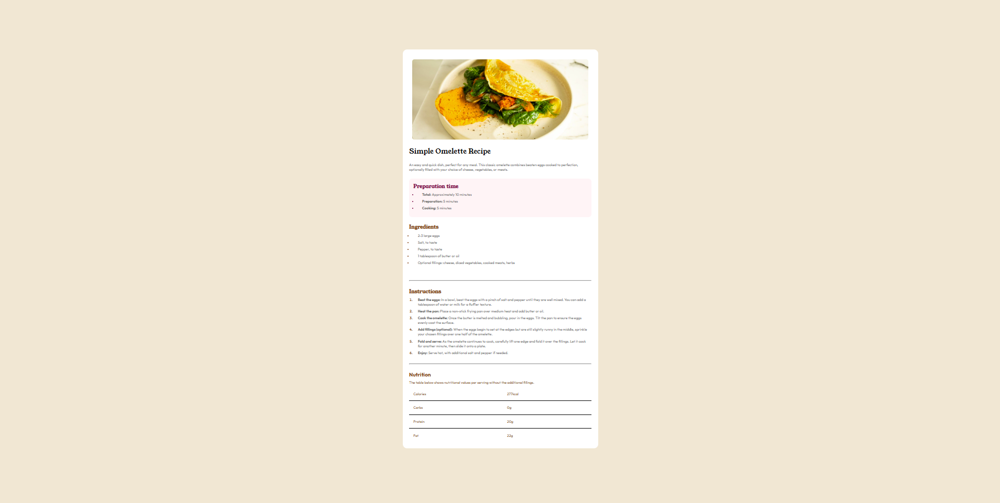

# Frontend Mentor - Recipe page solution

This is a solution to the [Recipe page challenge on Frontend Mentor](https://www.frontendmentor.io/challenges/recipe-page-KiTsR8QQKm). Frontend Mentor challenges help you improve your coding skills by building realistic projects. 

## Table of contents

- [Overview](#overview)
  - [The challenge](#the-challenge)
  - [Screenshot](#screenshot)
  - [Links](#links)
- [My process](#my-process)
  - [Built with](#built-with)
  - [What I learned](#what-i-learned)
  - [Continued development](#continued-development)
  - [Useful resources](#useful-resources)
- [Author](#author)

## Overview

### Screenshot



### Links

- Solution URL: [Add solution URL here](https://your-solution-url.com)
- Live Site URL: [Add live site URL here](https://your-live-site-url.com)

## My process

### Built with

- Semantic HTML5 markup
- CSS Flexbox
- Mobile-first workflow

### What I learned

In this project, I improved my skills in creating responsive web layouts using **Flexbox** and **media queries**. Flexbox allowed me to efficiently align and distribute elements, making the design more adaptable to different screen sizes. 

````css
.recipe {
  width: 100%;
  max-width: 700px;
  background-color: white;
  display: flex;
  flex-direction: column;
  justify-content: center;
}
````

I also used media queries to fine-tune the layout for various devices, ensuring a smooth user experience across desktops, tablets, and mobile phones.

````css
@media (min-width: 400px) {
  .recipe {
    width: 90%;
    margin: 20px;
    border-radius: 20px;
  }
  img {
    border-radius: 20px 20px 0 0;
  }
}
````

### Continued development

Moving forward, I want to deepen my understanding of **media queries** to create even more refined and adaptive layouts for different screen sizes. I also plan to explore **CSS transitions and animations** to enhance user experience with smooth and engaging visual effects. Additionally, I aim to learn **CSS frameworks** like Tailwind CSS to speed up development and maintain clean, scalable styles. By focusing on these areas, I hope to build more dynamic and visually appealing web projects. 🚀

### Useful resources

- [W3schools Flexbox Tutorial](https://www.w3schools.com/css/css3_flexbox.asp) - This helped me better understand how flexbox works.
- [MDN Web Docs Responsive Design](https://developer.mozilla.org/en-US/docs/Learn_web_development/Core/CSS_layout/Responsive_Design) - This is an amazing article which helped me finally understand responsive design.

## Author

- Michał Bąk
- Frontend Mentor - [@micha1bak](https://www.frontendmentor.io/profile/micha1bak)
